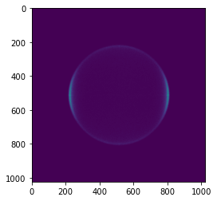

# SEVI 第二阶段大作业
[toc]

# 小组分工
张震 2019012131
- 统计参数范围并生成用于训练集的随机参数
- 训练神经网络以将电子分布还原为生成参数
- 训练用于判断测试集中电子位置的神经网络(未使用)

鲍怿 2019011619
- 生成随机参数的电子分布训练集以用于神经网络训练
- 将目标图像转化为电子打在荧光屏上的位置
- 生成第一类训练集中的局部图像和电子位置的关系，以用于神经网络训练(未使用)
# 实验思路
1. 根据测试集的图像中的高斯光斑, 计算电子实际打在MCP上的位置, 统计50000张图片上的电子位置, 得到二维电子分布矩阵, 元素为该位置总电子数，并归一化并乘以255
2. 实现程序,可以根据训练集的动量分布$\beta$和半径$R$范围, 模拟电子打在MCP上的位置, 并生成类似于第1步的二维电子分布矩阵
3. 利用第2步的程序, 生成形式为\"二维电子分布矩阵(输入)-动量分布(输出)\"的训练集, 预训练神经网络
4. 将第一步结果输入到训练好的网络中, 得到初步结果
5. 根据初步结果, 调整第2步程序中的参数范围, 生成精调数据集
6. 利用上一步的数据集对模型做fine-tuning
7. 利用训练好的模型, 计算最终结果, 每个球壳生成12个参数，共24个参数
- 初步实现但未最终使用的步骤:
    - 利用第一类训练集的高斯光斑与电子位置数据, 训练神经网络, 使之可以判断测试集中电子的正确位置
    - 使用更大或更优秀模型, 如resnet101/efficientnet(更难训练) 
# 注意事项
1. 运行script前注意**阅读复现方法**, 可能参数不适合运行环境
2. **程序会自动创建所需的文件夹**,无需自己创建

# 复现形式
## 根据训练好的模型&处理好的结果计算答案
1. [下载](https://cloud.tsinghua.edu.cn/f/436363d4b6e946e7844c/)模型参数,并放于`param/`目录下:
    
    https://cloud.tsinghua.edu.cn/f/436363d4b6e946e7844c/
2. [下载](https://cloud.tsinghua.edu.cn/f/23d8a6cb004b4152b6c5/)处理好的测试数据, 解压并放于`data/`目录下:

    https://cloud.tsinghua.edu.cn/f/23d8a6cb004b4152b6c5/

3. 运行
   ```shell
   bash script/gen_finaltest_answer.sh
   ```
	- 程序调用`script/gen_finaltest_npy.sh`生成的结果(上一步下载的参数)
	- 在根目录下生成`final.h5`文件
	
## 从头训练
1. 处理finaltest.h5
   - 将`finaltest.h5`放于data根目录下
   - 运行
        ```shell
        bash script/gen_finaltest_answer.sh
        ```
   - 将在`data/finaltest_npy`目录下生成.npy文件, 是处理后的测试集
   - 运行时间约为**40min**


2. 生成pretraining训练集
	- 运行
  		```shell
		bash script/gen_traindata_pretraining.sh
		```
	- 默认为**10**个进程, 可以根据性能调整for循环参数
	- 将生成**data/traindata**和**data/valid_data**目录存放训练和验证集
	- 运行时间约为**1h**
	- 默认参数需要**40G**空间


3. 开始预训练模型
   	- **运行前建议调整python第二个参数(epoch个数)**, 默认为100
   	- **运行前必须根据设备显卡数调整第一行参数,**
	- 运行
		```shell
		bash script/run_model.sh
		```
		将开始训练模型
	- 模型将loss平均值和标准差数据以.npy文件存在`data/train_loss`和`data/valid_loss`目录中, **可以通过`final.ipynb`文件查看loss曲线**
	- 每次重新运行会读取上次的参数, 模型参数保存在`param`目录中
	- **100**个epoch需要**4h**
	- 显卡内存需要**10G**左右, 若不足, 可以调小python后两个参数

4. 生成fine-tuning训练集
	- 与生成pretraining训练集几乎一样
	- 将覆盖pretraining训练集
	- 运行
  		```shell
		bash script/gen_traindata_fine_tuning.sh
		```
	- 运行时间约为**1h**

5. fine-tuning

	- 与开始预训练模型完全一样
	- 建议训练**40**个epoch

6. 生成答案

	- 运行
		```shell
		bash script/gen_finaltest_answer.sh
		```
	- 可以调整python第二个参数选取不同阶段的模型参数(需要自己备份参数,否则只有一个)
	- 在根目录下生成`final.h5`文件, 用作提交
  
# 神经网络模型
## ResNet34
- 模型参考ResNet[^1], 使用了`torchvision`包中的`resnet34`实现
[^1]He K ,  Zhang X ,  Ren S , et al. Deep Residual Learning for Image Recognition[J]. IEEE, 2016.

- 未使用预训练参数
## 模型修改
- 输入通道变为1
- 最后线性层fc变为 (512, 24) , 即最后输出为24个参数, 对应两个球壳的电子动量分布前12个参数

## 超参数, 优化器和loss函数
- learning_rate = 0.1
- epoch:
    - pretraining: 150
    - fine-tuning: 20+20+20(每个20更换训练集)
- 优化器: Adam
- loss和最终评估相同

$$
loss = \sum_{j=1}^2{\sqrt{
    \sum_{i=0}^{\infty}{\frac{2}{4i+1}(pred_{ij}-label_{ij})^2}
}}
$$


# 代码逻辑


按照文件夹,字典序介绍
## src
### `src/detect_e_position.py`(未使用)
> 根据高斯光斑判断电子位置
- 思路: 对图片上每个像素, 根据其周围n*n的像素点, 判断该位置是否为电子真实
- 模型:
  -  ( $3 \times 3$ 卷积 + pooling + 激活层 )*4
  -  线性层*2
  -  loss函数为`BCEloss`
  -  优化函数为`Adam`
- 根据 f1-loss 评估模型
- 模型准确率只能达到 $93\%$, 我们认为不能实际使用

### `src/gen_finaltest_answer.py`
> 计算最后结果
- 读取处理好的测试数据(10个.npy文件), 归一化并乘以255
- 加载模型, 输入, 将结果保存为`final.h5`

### `src/gen_finaltest_npy.py`
> 处理测试集
- 读取`data/finaltest.h5`(测试数据)
- 根据参数, 读取指定区间图片(为了后续并行计算), 调用`util/detect_center_points.py`获得指定区间图片的二维电子分布矩阵, 并保存为10个.npy文件

### `src/gen_gauss_data.py`(未使用)

> 生成\"根据高斯光斑判断电子位置\"模型的训练集
- 正样本: 电子真实位置附近n*n像素点
- 负样本: 全图像随机位置+距真实点较近的位置, 附近n*n像素点
- 数据保存在`data/gauss_validdata/`和`data/gauss_traindata/`目录

### `src/gen_my_beta_dist_fine_tuning.py`
> 根据首次得到的测试集结果生成新的训练集
- 更改了参数
- 详见`src/gen_my_beta_dist.py`

### `src/gen_my_beta_dist.py`
> 生成训练集
- 根据测试集范围, 生成电子动量分布和半径参数并调用`util/gen_my_pic_double.py`, 将返回的两个二维电子分布矩阵求和归一再乘以255，得到一个输入数据，为(1024, 1024)的数组
- 生成方式为:

    - 电子动量分布: 正态分布, 设置最大最小值截断
    - 半径: 均匀分布
    - 半径标准差: 均匀分布


- 数据保存在`data/traindata/`和`data/validdata/`目录

### `src/model.py`
> 模型相关函数模块
- `get_model`: 获取模型,并加载模型参数
- `save_model`: 保存模型参数

### `src/run.py`
> 模型训练主程序
- 获取训练集dataloader
- 获取模型及加载训练参数
- 训练并保存参数于`param/`目录

### `src/sevi_dataset.py`
> 加载数据集模块
- 在训练集和验证集目录下搜索文件并读取
- 使用`torch.utils.data`的`Dataset`和`DataLoader`打包数据集
### `src/train_func.py`
> 训练过程模块
- 定义loss函数与最终测试相同
- 分为`train`和`eval`过程, 将loss数据分别保存在`data/train_loss/`和`data/valid_loss`目录下

## util
### `util/detect_center_points.py`
> 将荧光屏上的图像还原为电子的像素位置
- 判断图像中的极大值点(多个相同值相邻时只取一个点)，并根据极大值的大小及一定半径上最大值和最小值之差(也就是该点有多"圆")判断其代表的电子数目(一个极大值点最多代表三个电子)
- 对判断为两个电子或三个电子的点，在极大值点附近通过寻找一定半径上的最大值方位来寻找电子位置
- 累加各张图得到的每个像素点的电子数，并返回二维电子分布矩阵
### `util/gen_my_pic_double.py`
> 使用ITM方法，利用给定的参数生成电子分布

- 利用输入的参数，得到目标勒让德多项式以-1为下界的积分，即 cos$\theta$ 的累积分布函数(CDF)
- 对于该累积分布函数，令cos$\theta$在(-1, 1)内截为1000000段，计算每个自变量对应的函数值，得到函数自变量和函数值的对应数组
- 生成 $U(0,1)$ ，作为累积分布函数的函数值以线性插值的方式映射回**cos$\theta$**，以此实现累积分布函数的反函数。生成的cos$\theta$即满足要求的勒让德多项式分布
- 生成每个电子的半径 $r$ 和 $\phi$ ，通过 cos$\theta$ ， $r$ 和 $\phi$ 得到电子的位置，然后计算得到其对应的像素点。
- 累加每个像素点的电子数，得到二维电子分布矩阵并输出


# 结果及分析
## loss曲线
- epoch0-210

    
- epoch150-210

    

## 评分distance

平台测试结果为: 0.046

url: https://physics-data.meow.plus/3adbce917b58

id: 2468

## 分析
- 根据曲线可以发现loss在30epoch时已经平缓, 此时可以更早的使用fine-tuning数据集, 减少训练次数
- 前150个epoch的validloss波动极大, 可能是因为生成的数据集中, 半径是分别随机生成的, 存在半径十分接近的情况, 较难分辨. fine-tuning数据集中半径不会重叠.


- 最终loss稳定在0.055到0.065之间(双球壳), 对比测试结果0.046(单球壳), 存在较大偏差. 原因可能在于从测试集图片中分辨电子位置有较大误差, 因为存在两个光斑距离较近的情况, 从物理上都不可分辨. 


	
# 以下为思考过程的记录(时间顺序为从后向前)
***
##  6.计算结果, 第一次提交 v3.0

- 读取模型参数, 将上一阶段的结果归一化后乘以255作为输入
### 测试结果

- 初步测试结果为 **0.052**

## 5.识别测试集图片中的电子位置

- 根据高斯光斑特征还原电子打在MCP上的位置

- 将测试集转换为上阶段模型所需的输入图片
### 问题

- 处理50000张图片所需约4小时, 我们将数据分为10组, 分别处理后将结果相加

## 4.使用自己生成的训练集训练

- 使用自己生成的数据集进行训练

### 变化

- 进行了显卡内存优化
- 增大了batch_size
- 扩大了数据量, 生成近8000组训练集
- 实验发现resnet18模型的loss下降较稳定, 可能是增大了batch_size的原因, 所以换为resnet34进行训练, 希望得到更好效果

### 训练过程及结果

- resnet34 在50个epoch后即有明显下降
- 150个epoch后可以达到稳定, 我们定义的方式算出来的loss可以达到0.005
- trick:
    由于内存限制, 不能生成过大数据集. 所以我们在模型稳定后, 不断生成一组新的数据集(约400)替换原有的数据并再跑5个epoch, 直到200个epoch后, loss可以降为0.003


## 3.生成自己的数据集

### 数据范围
- 我们统计了第二类数据集中的数据范围

    - beta参数: 使用正态分布生成, 对于超出范围的数据进行截断, 对每个球壳生成前12个参数

        ```python
        # beta分布参数
        limit = [
            [0.35, 1],
            [0.43, 1.434],
            [0.25, 1.24],
            [0.118, 0.9],
            [0.045, 0.6],
            [0.012, 0.36],
            [0.0026, 0.2],
            [0.0004, 0.1],
            [7.0e-5, 0.045],
            [5.6e-6, 0.019],
            [1.2e-7, 0.0067],
            [2e-9, 0.0023]
        ]
        mu = [1,0.85,0.55,0.25,0.1,0.04,0.015,0.002,0.004,0,0,0]
        sigma = [0.65,0.5,0.5,0.5,0.5,0.3,0.2,0.1,0.05,0.02,0.01,0.01]
        ```
    - 半径

        $R$ 为 **0.3** 到 **0.9** 的均匀分布

        $\sigma_R$ 为 **0.005** 到 **0.009** 的均匀分布
        
- 将数据按半径大小排列, 生成**input-label**对


## 2.第二次尝试: 双球壳 v2.0

### 数据集
- `data/gen_pic_double.ipynb`文件,生成`data_double.h5`数据文件
- 将初步尝试中的电子位置投射在 $1024 \times 1024$ 的矩阵上, 矩阵每个位置表示该位置有多少个电子打在上面.

- 将两个但球壳矩阵相加, 除以数量总和归一化, 再乘以255, 便于观察图像.

- 生成了3000个数据, 将1/10用作验证集

### 模型变化

- 将最后fc层输出变为24

### 训练效果

- 训练过程较单球壳慢, 约100个epoch后, loss下降到0.01以下

- 效果和单球壳的结果一样好, 可以平均化相对误差达到7\%, 证明该模型有效.

- 平均化相对误差:

    认为每个参数位置绝对误差相同, 根据平均loss计算得误差后, 除以0.7(与单球壳第一个个参数的数值相近)

    可以作为模型好坏的评价标准

- 局限性:

    1000个数据较少, 会导致模型泛化能力不够

    由于数据点为1000个单球壳的组合, 验证集中会出现训练集的数据, 导致模型过拟合,

    下一步尝试自己生成数据集

(模型训练过于复杂, 未完整保存过程)


## 1.第一次尝试 v1.0

将第二类数据集的每个球壳(能级)的电子找出来, 复原为图像, 从图像中识别分布信息

先尝试从单球壳中求分布

### 数据名

原始数据为`train{num}.h5`, 将电子位置,半径,球壳的beta存为`dataset_{num}.h5`

单球壳图像:



### 训练模型

使用`torchvision`的`resnet`模型, 包括18, 34, 101

### 模型

将resnet输入通道变为1, 最后线性层fc变为(512,12), 即最后输出为12个参数, 对应单球壳的beta分布前12个参数

### loss函数

loss函数定义如下:
```python
def loss_func(input,label):
    rate = 2/(np.array(range(1,13))*4+1)
    rate = torch.Tensor(rate)
    delta = input - label
    return torch.sum(torch.sum((delta**2 * rate),dim=1))/len(input)
```
即相比于评测函数, 这里少了求平方根的一步

两种评估对比较结果好坏是近乎相同的, 但这里计算量更小

### 训练方式

将第二类训练集的1000种数据分为训练集(900)和验证集(100)

由于训练过程较长, epoch较多, 训练过程并未保存完全, 大致情况为: 

resnet18: 

训练所需epoch较多, 在50个epoch之后loss偶有下降到0.01以下, 200个epoch后能下降到1e-5以下

resnet34,101:

100个epoch不能看出明显下降, 故放弃训练


### 设备信息

显卡: A100-SXM4-40GB 

Cpu: AMD EPYC 7302 16-Core Processor

训练时长: > 1min/epoch

### 评估

我认为单球壳的结果表明模型能提取到分布信息. 
根据loss结果, 平均到每个参数, 误差可以小于5%. 
下一步可以将两个球壳合并进行训练

